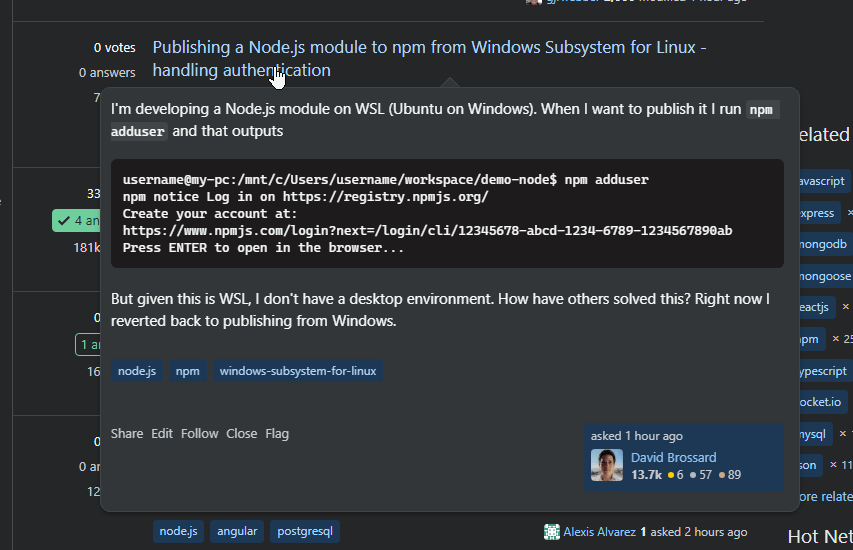

# stackoverflow-question-preview-extension

A Chrome extension to show a Wikipedia-style preview dialog on questions when hovering.

> 

## Installing

Not on Chrome webstore because I can't be bothered to make it work on other screen sizes or add error handling or whatever, so you need to build it yourself.

1. Clone/download repo
2. Install node 20
3. `npm install`
4. `npm run build`
5. Now `dist/` contains the unpacked Chrome extension, which you can load via Chrome -> Settings -> Extensions -> Developer mode -> Load unpacked

## Motivation

I like answering stuff on StackOverflow but the signal-to-noise ratio is poor and this helps me quickly see which questions are worth reading.

## License

MIT, see LICENSE
